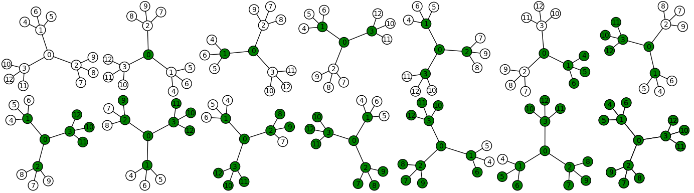

Fully leafed induced subtrees
~~~~~~~~~~~~~~~~~~~~~~~~~~~~~

This respository contains code for computing the leaf function of a graph. The
main algorithms used are described and analyzed in an article titled *Fully
leafed induced subtrees* (https://arxiv.org/abs/1709.09808). It was also used
to compute the leaf function of classical graphs.

Background
==========

Given a simple graph `G = (V,E)` and `T` a subset of `V`, we say that `T` is a
*fully leafed induced subtree* of size `i` if the following conditions are
satisfied:

1. `|T| = i` (`T` is of size `i`);
2. The subgraph `G[T]` induced by `T` is a tree;
3. The number of leaves of `G[T]` is maximum, i.e. there is no other induced
   subtree of size `i` having strictly more leaves than `G[T]`.

The *leaf function* of a graph `G` of `n` vertices, denoted by `L_G`, is the
function whose domain is `\{0,1,...,n\}` and such that `L_G(i)` is the number
of leaves of a fully leafed induced subtree of size `i`.

Since computing the leaf function is NP-hard for general graphs, the program is
expected to run for a long time if the graph has medium or large size. For
instance, it took about 3 days of computation to obtain the function for the
hypercube graph of dimension 6.

Dependencies
============

Currently, one must have `Sagemath <http://www.sagemath.org>`__ installed to
run the program. It is mostly used to have quick access to classical graphs. In
the future, we intend intend to remove the dependency and port the program to C
or C++.

How to use
==========

The main function is ``leaf_map(G)``. This function compute the leaf function
of a general graph ``G``. Special optimization can be used for particular cases
using the optional parameter ``algorithm``. The available options are:

- ``'general'``: The branch and bound algorithm for general graphs;
- ``'tree'``: A polynomial time algorithm based on dynamic programming;
- ``'cube'``: A specialized branch and bound algorithm exploiting the
  symmetries of the hypercubes.

Below are some examples that can be reproduced once Sagemath is started and the
three Python files loaded::

    sage: load('flis_graphs.py')
    sage: leaf_map(graphs.CompleteGraph(7))[0]
    {0: 0, 1: 0, 2: 2, 3: None, 4: None, 5: None, 6: None, 7: None}
    sage: leaf_map(graphs.CycleGraph(10))[0]
    {0: 0, 1: 0, 2: 2, 3: 2, 4: 2, 5: 2, 6: 2, 7: 2, 8: 2, 9: 2, 10: None}
    sage: leaf_map(graphs.WheelGraph(11))[0]
    {0: 0, 1: 0, 2: 2, 3: 2, 4: 3, 5: 4, 6: 5, 7: 2, 8: 2, 9: 2, 10: None, 11: None}
    sage: leaf_map(graphs.CompleteBipartiteGraph(7,5))[0]
    {0: 0, 1: 0, 2: 2, 3: 2, 4: 3, 5: 4, 6: 5, 7: 6, 8: 7, 9: None, 10: None, 11: None, 12: None}
    sage: leaf_map(graphs.PetersenGraph())[0]
    {0: 0, 1: 0, 2: 2, 3: 2, 4: 3, 5: 3, 6: 4, 7: 3, 8: None, 9: None, 10: None}
    sage: leaf_map(graphs.CubeGraph(3), algorithm='cube')[0]
    {0: 0, 1: 0, 2: 2, 3: 2, 4: 3, 5: 2, 6: None, 7: None, 8: None}
    sage: leaf_map(graphs.BalancedTree(2, 2), algorithm='tree')[0]
    {0: 0, 1: 0, 2: 2, 3: 2, 4: 3, 5: 3, 6: 3, 7: 4}

Below are additional examples with pictures. A ternary tree::

    sage: load('flis_graphs.py')
    sage: from itertools import product
    sage: B = graphs.BalancedTree(3, 2)
    sage: (L,E) = leaf_map(B, algorithm='tree')
    sage: def plot_subgraph(graph, subgraph):
    ....:     vertex_colors = {}
    ....:     vertex_colors['white'] = set(graph) - set(subgraph)
    ....:     vertex_colors['green'] = subgraph
    ....:     edge_colors = {}
    ....:     edge_colors['green'] = [(u,v) for (u, v) in product(subgraph, subgraph) if graph.has_edge(u, v)]
    ....:     return graph.plot(vertex_colors=vertex_colors)
    sage: G = graphics_array([plot_subgraph(B, E[i][0]) for i in range(14)], 2, 7)
    sage: G.show(figsize=[14,4])

And the Petersen graph::

    sage: load('flis_graphs.py')
    sage: from itertools import product
    sage: P = graphs.PetersenGraph()
    sage: (L,E) = leaf_map(P, algorithm='general')
    sage: def plot_subgraph(graph, subgraph):
    ....:     vertex_colors = {}
    ....:     vertex_colors['white'] = set(graph) - set(subgraph)
    ....:     vertex_colors['green'] = subgraph
    ....:     edge_colors = {}
    ....:     edge_colors['green'] = [(u,v) for (u, v) in product(subgraph, subgraph) if graph.has_edge(u, v)]
    ....:     return graph.plot(vertex_colors=vertex_colors)
    sage: G = graphics_array([plot_subgraph(P, E[i][0]) for i in range(8)], 2, 4)
    sage: G.show(figsize=[14,7])

.. image:: images/flis-petersen.png

License
=======

All files in this repository are subject to the `GPLv3 license
<https://www.gnu.org/licenses/gpl-3.0.en.html>`__.
